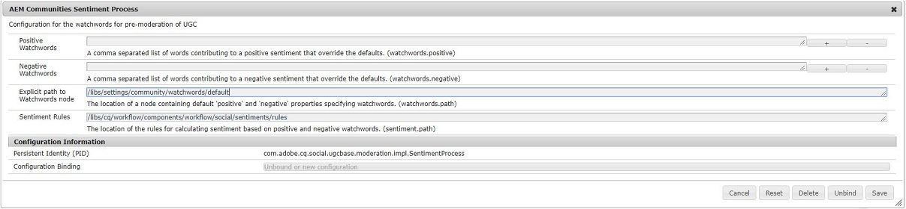

aem-communities-watchwords-extension
====================================

This extension provides a sample implementation of com.adobe.cq.social.ugcbase.moderation.AutoModerationProcess to implement a new UGCModerationFilter.
The sample works on the basis of sentiment score. However, the resource of ugc created will also be available through this interface and this resource can be processed to provide
desired ugc(User Generated Content) moderation.

Building the sample
===================

* Change directory to the root of the repository aem-communities-watchwords-extension.
* Run *mvn clean install*.
* A successful build should create a bundle artifact in *bundles/aem-communities-watchwords-extension* and a package artifact(with bundle embedded) in *content/target*.

Installing the sample
=====================

* Use the package manager at http://[server]/crx/packmgr/index.jsp and upload the zip file found at *content/target*.
* Install the package.
* Add Watchwords path in AEM Communities Sentiment Process at http://[server]/system/console/configMgr by default the negative and positive paths are located at
/libs/settings/community/watchwords/default.
* Configure the AutoModeration component at http://[server]/system/console/configMgr - Search for AEM Communities Auto Moderation(>=AEM 6.4) or automoderation(<AEM 6.4).
* Add UGCModerationFilter in the list of Automoderaion Sequences, just like SentimentProcess & ProfanityFilter.

 

